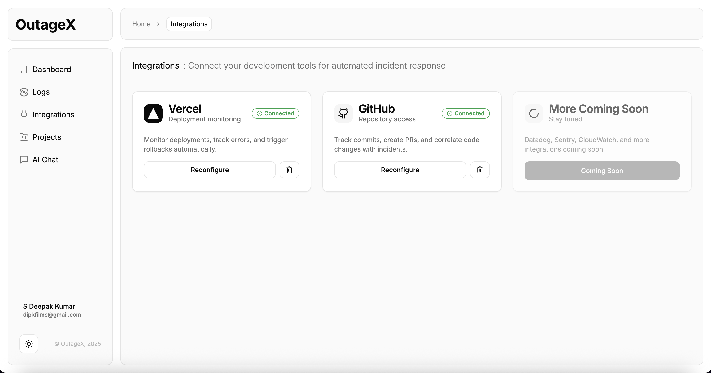

# 🔥 OutageX

**Autonomous AI-Powered Incident Response System**

OutageX is a full-stack DevOps platform that automatically detects, analyzes, and fixes production incidents using AI. It integrates with Vercel and GitHub to monitor your applications, detect errors in real-time, and autonomously generate and deploy fixes.

---

## 📸 Screenshots

### Dashboard


### Projects Management


### Integrations


### AI Chat Assistant


### Logs Viewer


### Incident Details


---

## ✨ Features

### 🤖 **Autonomous Incident Response**
- **Automatic Error Detection** - Real-time monitoring of runtime errors via SDK
- **AI-Powered Analysis** - Uses Groq (Llama 3.3 70B) to analyze incidents
- **Intelligent Root Cause Analysis** - Correlates errors with recent commits and code changes
- **Automated Fix Generation** - AI generates code fixes based on error analysis
- **E2B Sandbox Testing** - Tests fixes in isolated environment before deployment
- **Automatic PR Creation** - Creates GitHub pull requests with fixes
- **Auto-Merge** - Optionally auto-merges PRs when confidence is high

### 🔗 **Integrations**
- **Vercel Integration** - Monitor deployments, health metrics, and logs
- **GitHub Integration** - Access repositories, create PRs, manage webhooks
- **Automatic Webhook Management** - Creates and manages webhooks automatically
- **Project Discovery** - Automatically discovers Vercel projects and linked GitHub repos

### 📊 **Monitoring & Analytics**
- **Real-time Dashboard** - Live incident monitoring and metrics
- **Live Logs Viewer** - Stream logs from all projects in real-time
- **System Health Metrics** - CPU, memory, error rate, requests/sec
- **Incident Timeline** - Track incident response progress
- **Project Management** - Add, configure, and monitor multiple projects

### 💬 **AI Code Assistant**
- **ChatGPT-style Interface** - Ask questions about your codebase
- **Context-Aware** - Understands your repository structure
- **Code Analysis** - Explains code, finds issues, suggests improvements
- **Markdown Support** - Beautiful code formatting with syntax highlighting

### 🛡️ **Security & Reliability**
- **Encrypted Credentials** - All integration tokens encrypted at rest
- **Webhook Signature Verification** - Secure webhook handling
- **Sandboxed Code Execution** - E2B sandbox for safe testing
- **Error Thresholds** - Configurable incident triggers

---

## 🏗️ Architecture

```
OutageX/
├── frontend/          # Next.js 14 frontend
├── backend/           # Node.js/Express backend
└── sdk/              # Client-side SDK for error reporting
```

### **Tech Stack**

**Frontend:**
- Next.js 14 (App Router)
- TypeScript
- Tailwind CSS
- Zustand (State Management)
- Socket.io Client (Real-time)
- React Markdown (Code Display)

**Backend:**
- Node.js + Express
- TypeScript
- Socket.io (WebSocket)
- PostgreSQL + Drizzle ORM
- Groq SDK (AI)
- E2B SDK (Sandbox)
- MCP Protocol (Model Context Protocol)

**Integrations:**
- Vercel API
- GitHub API
- E2B Sandbox (MCP Servers: GitHub, Perplexity, Exa)

---

## 🚀 Quick Start

### **Prerequisites**
- Node.js 18+
- PostgreSQL database (Supabase recommended)
- API Keys:
  - Groq API Key
  - E2B API Key
  - Perplexity API Key (optional)
  - Exa API Key (optional)

### **1. Clone Repository**
```bash
git clone <repository-url>
cd outagex
```

### **2. Backend Setup**
```bash
cd backend
npm install
cp .env.example .env
# Edit .env with your API keys and database URL
npm run dev
```

### **3. Frontend Setup**
```bash
cd frontend
npm install
cp .env.example .env.local
# Edit .env.local with backend URL
npm run dev
```

### **4. Database Setup**
```bash
cd backend
npm run db:generate
npm run db:migrate
```

### **5. Access Application**
- Frontend: http://localhost:3000
- Backend: http://localhost:3001

---

## 📖 Documentation

- **[Backend README](./backend/README.md)** - Backend setup and API documentation
- **[Frontend README](./frontend/README.md)** - Frontend setup and development guide
- **[SDK README](./sdk/README.md)** - Client-side SDK integration guide

---

## 🔑 Environment Variables

### **Backend (.env)**
```env
# Database
DATABASE_URL=postgresql://...

# API Keys
GROQ_API_KEY=your_groq_key
E2B_API_KEY=your_e2b_key
PERPLEXITY_API_KEY=your_perplexity_key
EXA_API_KEY=your_exa_key

# Server
PORT=3001
FRONTEND_URL=http://localhost:3000
BACKEND_URL=http://localhost:3001
```

### **Frontend (.env.local)**
```env
NEXT_PUBLIC_BACKEND_URL=http://localhost:3001
NEXT_PUBLIC_SOCKET_URL=http://localhost:3001
```

---

## 🎯 Key Features Explained

### **1. Automatic Incident Detection**
- SDK captures runtime errors from your application
- Errors are reported to backend in real-time
- When error threshold is met (3 errors in 5 minutes), incident is triggered

### **2. AI-Powered Analysis**
- Groq AI analyzes error logs and stack traces
- Correlates with recent GitHub commits
- Uses Perplexity/Exa for research on similar issues
- Identifies root cause with confidence score

### **3. Automated Fix Generation**
- AI generates code fix based on root cause
- Fix is tested in E2B sandbox for syntax validation
- Creates GitHub PR with fix
- Optionally auto-merges if confidence is high

### **4. Real-time Monitoring**
- Socket.io for real-time updates
- Live logs streaming
- Incident status updates
- Dashboard metrics

---

## 📝 License

MIT

---

## 🤝 Contributing

Contributions welcome! Please open an issue or PR.

---

## 📧 Support

For issues or questions, please open an issue on GitHub.

